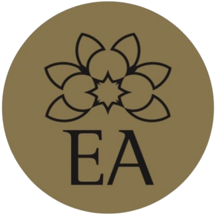

<!DOCTYPE html>
<html lang="en">
<head>
    <meta charset="UTF-8">
    <meta name="viewport" content="width=device-widtºh, initial-scale=1.0">
    <link rel="stylesheet" href="index.css">
    <title>Essència Alqvímica</title>
</head>
<body> 
    

        
        <h1 style="font-weight: bold">BELLESA NATURAL</h1>  
    
  

    

        <h2 style="font-weight: 200;">EA SOM UN CENTRE D'ESTÈTICA I COSMÈTICA 
            NATURAL ON UNIM BENESTAR FÍSIC I EMOCIONAL 
            PER ARRIBAR A LA BELLESA I LA SALUT, AMB  
            UN RESPECTE ABSOLUT PER LA NATURA QUE ENS ENVOLTA                       
            BUSQUEM LA COMBINACIÓ MÉS ADIENT, ENTRE  
            L'AROMATERÀPIA DE LA MÀ D'ALQUIMIA, LA FITOTERÀPIA I  
            MADEROTERÀPIA DE LA DE VAGHEGGI I LA FOTOTERÀPIA 
            DE LA MÀ DE LIPOLED DE MEDILUX, PER TRACTAR LES  
            NECESITATS DELS NOSTRES CLIENTS.  
            RESERVA EL TEU DIAGNÒSTIC GRATUÏT I COMENÇA 
            EL TEU CAMÍ DE TRANSFORMACIÓ PERSONAL.  
        </h2>

    

    

    
  
        <a class="button" href="facials/facials.html">
            
 
                

            

        </a>
        
        <a class="button" href="corporals/corporals.html">
            
 
                

            

        </a>

        <a class="button" href="">
            
 
                

            

        </a>
    

    
      
</body>
</html>